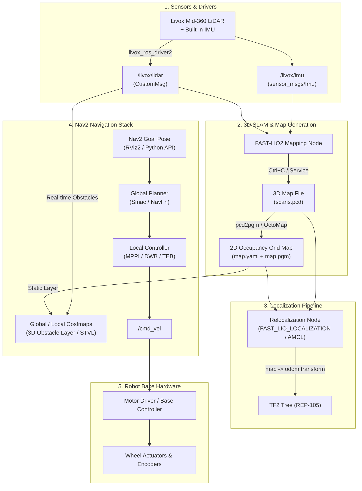

# Autonomous Navigation Plan: 3D Livox Scan to Nav2 Point-to-Point Navigation

## 🎯 Objective
Enable a mobile robot equipped with a **Livox Mid-360 LiDAR** to:
1. Perform a high-resolution 3D scan and map an environment using **FAST-LIO2**.
2. Convert and preprocess the 3D map for navigation.
3. Relocalize within the prior map.
4. Autonomously plan paths, avoid obstacles, and navigate between target goal coordinates using the **ROS 2 Nav2** stack.

---

## 🏗️ High-Level System Architecture



---

## 📅 Step-by-Step Implementation Roadmap

---

### **Phase 1: 3D Mapping & Map Conversion**

#### 1.1 Capture the 3D Environment Scan
* Run `livox_ros_driver2` and `fast_lio` in mapping mode.
* Drive or carry the robot steadily around the environment to capture full geometry and loop closures.
* Terminate `laserMapping` (`Ctrl + C`) to save the accumulated point cloud:
  * File location: `src/FAST_LIO/PCD/scans.pcd`.

#### 1.2 Convert 3D Point Cloud (`.pcd`) into 2D Occupancy Grid (`.yaml` + `.pgm`)
Standard Nav2 costmaps require 2D grid maps. Use one of the following methods:
* **Option A (Recommended): `pcd2pgm` Tool**
  * Slices the 3D PCD point cloud along the Z-axis (e.g. between `0.1m` and `1.5m` from ground level).
  * Projects laser hit points onto a high-resolution 2D occupancy grid.
  * Outputs: `map.yaml` and `map.pgm`.
* **Option B: `octomap_server` or `grid_map`**
  * Builds a 3D Octree / 2.5D elevation map and projects a 2D projection layer for Nav2.

---

### **Phase 2: Robot TF Tree & Frame Modeling (REP-105 Standards)**

Nav2 strictly relies on standard coordinate frames and transforms:
```
map  ──►  odom  ──►  base_footprint  ──►  base_link  ──►  livox_frame
```

#### 2.1 Robot Description (URDF / Xacro)
* Create a robot description package (e.g., `robot_description`).
* Define rigid transforms:
  * `base_link` $\to$ `livox_frame` (LiDAR mounting offset $x, y, z, \text{roll}, \text{pitch}, \text{yaw}$).
  * `base_footprint` (projection on ground plane) $\to$ `base_link`.
* Launch `robot_state_publisher` to publish static transforms via `/tf_static`.

#### 2.2 Odometry Publishing
* Configure FAST-LIO or wheel encoders to broadcast the `odom -> base_footprint` transform and `/odom` topic.

---

### **Phase 3: Real-Time Map Relocalization**

The robot must determine where it is inside the pre-built map without drifting.

#### Approach A: 3D Point-Cloud-Based Localization (High Accuracy)
* Integrate **`FAST_LIO_LOCALIZATION`** or **`small_gicp_relocalization`**:
  * Loads the prior `scans.pcd` map into an ikd-Tree / KD-Tree.
  * Continuously registers incoming live Livox scans against the prior map using point-to-plane ICP.
  * Directly publishes the high-frequency, drift-free `map -> odom` transform.

#### Approach B: 2D Scan Conversion + Standard Nav2 AMCL
* Convert live Livox 3D point clouds to virtual 2D laser scans using `pointcloud_to_laserscan`.
* Feed virtual 2D scans into `nav2_amcl` with the 2D occupancy map (`map.yaml`).

---

### **Phase 4: Base Drive Controller & Motor Interface**

#### 4.1 Base Actuation Interface
* Implement the hardware interface (via `ros2_control`, micro-ROS, or serial node) that:
  * Subscribes to `/cmd_vel` (`geometry_msgs/msg/Twist`).
  * Converts linear ($v_x$) and angular ($\omega_z$) velocities into motor commands (e.g., differential, omnidirectional, or Ackermann).
  * Publishes wheel odometry and encoder feedback.

#### 4.2 Emergency Stop & Safety Limits
* Configure velocity safety limits (max linear velocity, max angular velocity, acceleration limits) in `cmd_vel_mux` / `velocity_smoother`.

---

### **Phase 5: Nav2 Stack Integration & Configuration**

Install the standard ROS 2 navigation stack:
```bash
sudo apt update
sudo apt install ros-humble-navigation2 ros-humble-nav2-bringup
```

#### 5.1 Costmap Configuration (`nav2_params.yaml`)
* **Global Costmap**:
  * Static Layer: Pre-built 2D grid map (`map.yaml`).
  * Obstacle Layer: Real-time sensor raytracing.
  * Inflation Layer: Safe clearance radius around robot base footprint.
* **Local Costmap**:
  * Rolling window (e.g., $4\text{m} \times 4\text{m}$).
  * Voxel / Spatio-Temporal Voxel Layer (STVL): Handles 3D obstacles (e.g., overhanging obstacles, low tables, dynamic people) detected by Livox Mid-360.
  * Inflation Layer.

#### 5.2 Planners and Controllers Selection
* **Global Planner**:
  * `nav2_smac_planner::SmacPlanner2D` or `nav2_navfn_planner::NavfnPlanner` for shortest obstacle-free trajectory.
* **Local Path Tracking Controller**:
  * **MPPI Controller** (`nav2_mppi_controller::MPPIController`): Recommended for high dynamic safety and smooth 3D obstacle avoidance.
  * Alternatively: `DWBController` or `TEB Local Planner`.

---

### **Phase 6: Autonomous Mission Execution & Testing**

#### 6.1 Interactive Navigation (RViz2)
1. Launch Livox driver, localization, and Nav2 bringup.
2. Open RViz2 configured with Nav2 display plugin.
3. Click **"2D Pose Estimate"** to set the initial robot pose (if using AMCL) or verify automatic alignment.
4. Click **"Nav2 Goal"** anywhere on the map:
   * Robot computes global path $\to$ executes local control $\to$ reaches goal position with target orientation $\to$ stops smoothly.

#### 6.2 Programmatic Navigation (Python API)
Create automated mission scripts (patrol routes, delivery points) using `nav2_simple_commander`:
```python
from nav2_simple_commander.robot_navigator import BasicNavigator
import rclcpp
from geometry_msgs.msg import PoseStamped

rclcpp.init()
navigator = BasicNavigator()

# Define Waypoint A -> Waypoint B
goal_pose = PoseStamped()
goal_pose.header.frame_id = 'map'
goal_pose.pose.position.x = 2.5
goal_pose.pose.position.y = 1.0
goal_pose.pose.orientation.w = 1.0

navigator.goToPose(goal_pose)
while not navigator.isTaskComplete():
    feedback = navigator.getFeedback()
    print(f"Distance remaining: {feedback.distance_remaining:.2f} m")

print("Navigation Result:", navigator.getResult())
```

---

## 🧰 Required Software Packages to Install/Add

| Package | Purpose |
| :--- | :--- |
| `livox_ros_driver2` *(Installed)* | Livox LiDAR hardware driver |
| `fast_lio` *(Installed)* | 3D LiDAR-Inertial mapping & odometry |
| `pcd2pgm` | Converts `scans.pcd` into 2D Occupancy Grid (`.yaml` / `.pgm`) |
| `FAST_LIO_LOCALIZATION` | High-precision 3D scan-to-map relocalization |
| `navigation2` / `nav2_bringup` | Global/local planning, behavior trees, costmaps |
| `spatio_temporal_voxel_layer` | 3D Voxel costmap plugin for 3D LiDAR obstacle clearance |
| `robot_state_publisher` | Publishes standard TF tree (`base_link -> livox_frame`) |

---

## 🏁 Milestones & Verification Checklist

- [ ] **Milestone 1**: Scan area with FAST-LIO2 and verify saved `scans.pcd` point cloud density.
- [ ] **Milestone 2**: Generate 2D `map.yaml` & `map.pgm` using `pcd2pgm` and verify obstacle boundaries in GIMP / RViz.
- [ ] **Milestone 3**: Setup URDF and verify `map -> odom -> base_link -> livox_frame` transforms in `tf2_tools view_frames`.
- [ ] **Milestone 4**: Validate relocation accuracy by driving manually and checking map overlay in RViz.
- [ ] **Milestone 5**: Launch Nav2 stack and tune Costmap inflation and MPPI controller parameters.
- [ ] **Milestone 6**: Execute end-to-end autonomous navigation between arbitrary points A and B.
