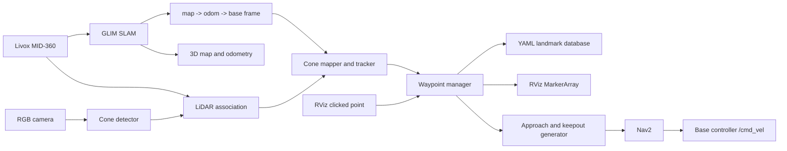

# Waypoint and Cone Implementation Guide

## 1. Purpose and scope

This guide describes the recommended waypoint system for the rover's IRC 2026
workflow. It builds on the existing Livox MID-360 and GLIM stack without assuming that
GLIM performs path planning.

The system should:

1. mark cone and mission-object positions on the live GLIM map;
2. distinguish destinations from hazards and no-go boundaries;
3. save the marked positions with their meaning and confidence;
4. generate safe approach poses near selected markers; and
5. hand those poses to Nav2 after the rover's drive, costmap, and localization
   interfaces are ready.

The recommended approach is to implement **semantic landmarks first** and derive
navigation waypoints from them. A cone's measured position is an obstacle; it should
not be sent directly to Nav2 as a goal.

## 2. IRC 2026 requirements that affect the design

The [official IRC 2026 rulebook](https://roverchallenge.org/wp-content/uploads/2025/10/IRC-2026-Rulebook.pdf)
states that:

- supplied GPS coordinates use WGS 84 latitude/longitude in decimal degrees;
- any red-marked area or object is a no-go zone, including a red traffic cone;
- reconnaissance results include a photograph and GPS coordinates for each located
  object;
- autonomous delivery locations may be described by approximate GPS coordinates or
  marker colours; and
- during autonomous delivery, operators may monitor telemetry but may not transmit
  commands.

Therefore, a marker must contain more than an `(x, y)` coordinate. At minimum it needs
an ID, colour, role, confidence, source, timestamp, and map-frame position. Red cones
must default to `NO_GO` until mission instructions explicitly say otherwise.

## 3. Recommended architecture



Use four small ROS 2 packages rather than one monolithic node:

| Package | Responsibility |
|---|---|
| `rover_interfaces` | Cone-array messages and add/update/delete/save services |
| `rover_perception` | Camera detection, LiDAR association, colour classification |
| `rover_waypoints` | Landmark fusion, persistence, RViz markers, approach poses |
| `rover_nav_bringup` | Nav2, costmaps, keepout filters, mission execution |

Python is suitable for the waypoint manager and mission state machine. Use C++ for
high-rate point-cloud association only if Python cannot meet the required rate.

## 4. Coordinate frames and ownership

Use a single TF tree:

```text
map -> odom -> base_link -> livox_frame
                         -> camera_link
```

- Every stored landmark and navigation goal must use `frame_id: map`.
- Transform a detection at the detection message's timestamp, not at the current time.
- Calibrate and publish the rigid `base_link -> livox_frame` and
  `base_link -> camera_link` transforms from the rover URDF.
- Only one node may publish each TF edge. Do not allow GLIM and another localization
  node to publish competing `map -> odom` transforms.
- Give each map a unique `map_id`; refuse to load landmarks whose `map_id` differs.

### Important limitation of the current workspace

The current GLIM setup performs localization during the active SLAM session. Opening a
saved dump in `offline_viewer` does not localize the live rover against that dump. GLIM
also creates a new local map origin on a new run. Consequently, `map` coordinates saved
in one session must not be used for autonomous driving in another session until one of
these is implemented:

1. persistent scan-to-map relocalization that restores the same `map` frame; or
2. a surveyed GNSS/ENU frame and a verified transform between that frame and the GLIM
   map.

For early development, create, mark, and visit waypoints during one uninterrupted GLIM
session.

## 5. Data model

Create a custom cone observation and landmark message instead of encoding operational
data only as RViz markers. RViz markers are a display output, not the database.

Recommended landmark fields:

| Field | Meaning |
|---|---|
| `id` | Stable unique ID such as `cone_0042` |
| `pose` | `geometry_msgs/PoseWithCovariance` in `map` |
| `colour` | `UNKNOWN`, `RED`, `BLUE`, `YELLOW`, and so on |
| `role` | `UNCLASSIFIED`, `TARGET`, `ROUTE`, `NO_GO`, `OBJECT` |
| `confidence` | Fused confidence from 0.0 to 1.0 |
| `source` | `MANUAL`, `CAMERA_LIDAR`, `GPS`, or `IMPORTED` |
| `observation_count` | Number of matched observations |
| `first_seen` / `last_seen` | ROS timestamps |
| `photo_uri` | Optional reconnaissance image location |
| `gps` | Optional WGS 84 latitude/longitude measurement |

Use a `ConeLandmarkArray` with one common `std_msgs/Header` for publishing. Publish
RViz visualization separately as `visualization_msgs/MarkerArray`.

Suggested topics and services:

| Interface | Type | Purpose |
|---|---|---|
| `/cone_map/landmarks` | `ConeLandmarkArray` | Fused semantic landmarks |
| `/cone_map/markers` | `visualization_msgs/MarkerArray` | RViz cones, labels, and confidence |
| `/waypoints/markers` | `visualization_msgs/MarkerArray` | Approach poses and route lines |
| `/clicked_point` | `geometry_msgs/PointStamped` | Manual RViz input for the MVP |
| `/cone_map/add` | service | Add or confirm a landmark |
| `/cone_map/update` | service | Correct role, colour, or pose |
| `/cone_map/delete` | service | Remove a false detection |
| `/cone_map/save` | service | Atomically save YAML |
| `/cone_map/load` | service | Load only a matching `map_id` |

Publish the two marker topics with reliable, transient-local QoS so a newly opened RViz
receives the latest set immediately.

An example persistence file is:

```yaml
version: 1
map_id: glim_20260911_103000
frame_id: map
landmarks:
  - id: cone_0001
    colour: red
    role: no_go
    position: {x: 7.42, y: -1.18, z: 0.0}
    covariance_xy: [0.04, 0.00, 0.00, 0.04]
    confidence: 0.94
    source: camera_lidar
    observation_count: 11
  - id: cone_0002
    colour: blue
    role: target
    position: {x: 12.10, y: 4.55, z: 0.0}
    covariance_xy: [0.09, 0.00, 0.00, 0.09]
    confidence: 0.87
    source: camera_lidar
    observation_count: 7
```

Write to a temporary file and rename it only after a successful write so a power loss
cannot leave a partially written mission file.

## 6. Phase 1: manual waypoint marking MVP

Build this phase before automatic cone detection. It validates TF, storage,
visualization, and navigation without perception uncertainty.

1. Add the RViz `Publish Point` tool and set the RViz fixed frame to `map`.
2. Subscribe to `/clicked_point` in `waypoint_manager`.
3. Project the selected 3D point onto the locally estimated ground plane.
4. Open a small service or terminal prompt to assign colour and role. Default red to
   `NO_GO`; never default it to `TARGET`.
5. Store the landmark and publish:
   - a cone-shaped or cylinder marker at the measured point;
   - a text marker containing ID, colour, role, and confidence; and
   - an uncertainty circle derived from pose covariance.
6. Support update, delete, clear, save, and load operations.
7. Use ROS timestamps and record the active `map_id` in every saved file.

Marker colours should match observed colours. Use a red translucent disk or polygon for
no-go regions and a separate arrow for an approach pose. This prevents an operator from
confusing the physical cone with the commanded stopping position.

## 7. Phase 2: automatic cone detection and mapping

### 7.1 Use camera and LiDAR together

The MID-360 measures geometry and reflectivity, not visible colour. It cannot reliably
classify marker colour by itself. Use an RGB camera for detection and colour, then use
LiDAR for metric position.

Recommended processing sequence:

1. Calibrate camera intrinsics.
2. Calibrate the camera-to-LiDAR extrinsic transform and add it to the URDF.
3. Detect cones in each image using a trained object detector. Keep colour as a separate
   classifier or detector class.
4. Transform LiDAR points into the camera frame and project them into the image.
5. Select points inside each detection mask or lower part of its bounding box.
6. Reject ground points and statistical outliers.
7. Estimate the cone base centre and covariance from the remaining cluster.
8. Publish the observation in the sensor frame with the original timestamp.
9. Transform it into `map` using `tf2` and send it to the cone mapper.

If too few LiDAR returns fall on a distant cone, use a ground-plane ray intersection as
a fallback but assign it a larger covariance and lower confidence.

### 7.2 Fuse observations into stable landmarks

Do not create a new marker for every frame. For each observation:

1. find existing landmarks of compatible colour within a covariance-aware gating
   radius;
2. update the matched position and covariance with a weighted filter;
3. increment its observation count and update `last_seen`; or
4. create a tentative landmark if no match exists.

Only promote a tentative landmark to confirmed after at least three observations from
more than one rover pose. Reject isolated detections after a timeout. Begin testing with
a conservative Euclidean association gate of `0.4 m`, then tune it using recorded data.

Large GLIM loop-closure corrections can move the optimized map relative to an earlier
measurement. During the MVP, continuously re-observe and update cones and avoid saving
until mapping has stabilized. A later production implementation should associate each
landmark observation with the relevant GLIM keyframe/submap and re-optimize landmark
positions after loop closure.

## 8. Generate navigation goals from landmarks

Never navigate to the cone centre. Generate an **approach pose** in free space:

```text
approach_position = cone_position - standoff_distance * approach_direction
approach_yaw      = angle from approach_position toward cone_position
```

Choose the approach direction by sampling candidate poses around the cone and rejecting
those that are occupied, unknown, too steep, or inside a keepout region. Rank the
remaining candidates by:

1. valid Nav2 path;
2. obstacle and drop-off clearance;
3. slope and traversability;
4. path length; and
5. camera or manipulator visibility of the target.

Start with a configurable `1.5 m` standoff distance and tune it to the rover footprint,
braking distance, camera field of view, and arm reach. Inflate every prohibited cone or
object by at least:

```text
rover circumscribed radius + localization uncertainty + braking margin
```

For a row of red cones that explicitly defines a boundary, construct a keepout polyline
or polygon. A single red cone should create a local keepout disk; do not invent a larger
boundary unless mission instructions define one.

Before execution, request a Nav2 path to the approach pose and reject the command if the
path is empty, crosses a keepout region, or exceeds configured slope/clearance limits.

## 9. GPS waypoints for IRC

Mission coordinates are approximate WGS 84 positions. Keep the original latitude and
longitude in the mission database, and convert them to a local Cartesian frame only
through a defined datum and heading.

The recommended long-term design is:

1. use an RTK-capable GNSS receiver where competition rules and hardware permit;
2. obtain absolute heading from a dual-antenna GNSS or a properly calibrated heading
   source;
3. establish an ENU/UTM datum at mission start;
4. estimate and verify the rigid transform between the GNSS-local frame and the GLIM
   `map` frame; and
5. transform supplied GPS goals into `map` before generating a local approach pose.

ROS `robot_localization` provides `navsat_transform_node` for combining GNSS, heading,
and odometry data, while Nav2 provides GPS waypoint examples. Integrate them only after
deciding which component owns `map -> odom`; competing TF publishers are unsafe.

Treat the supplied coordinate as a search-region centre, not a guaranteed cone centre.
Navigate to a safe observation pose near that region, detect the requested colour,
refine the landmark location, and then generate the final approach pose.

## 10. Nav2 integration

GLIM provides pose estimation and a 3D map. It does not provide the complete navigation
stack. Before allowing waypoint execution, the rover also needs:

- a tested `base_link` and footprint;
- a base controller that consumes `/cmd_vel` and reports odometry;
- a traversability or 2D/2.5D costmap derived from LiDAR data;
- obstacle, inflation, and keepout layers;
- negative-obstacle and excessive-slope handling;
- recovery behaviours that do not enter no-go areas; and
- an independently tested emergency stop.

Use Nav2's `NavigateToPose` for a single approach pose. Use `FollowWaypoints` when the
rover must stop and perform an action at each destination. Use `NavigateThroughPoses`
only for intermediate route constraints where stopping at each pose is unnecessary.
Nav2's waypoint task-executor plugins can later trigger a photograph, confirmation, or
manipulator handoff at arrival.

The mission state machine should be explicit:

```text
IDLE -> SEARCH_REGION -> CONFIRM_LANDMARK -> PLAN_APPROACH
     -> VERIFY_PATH -> NAVIGATE -> ARRIVAL_CHECK -> TASK -> COMPLETE
                          |                |
                          +---- ABORT <----+
```

Abort and command zero velocity when localization becomes stale, the TF chain breaks,
the target changes unexpectedly, the path enters a keepout region, or the hardware
emergency stop is asserted.

## 11. Development order

### Milestone A: marker database

- [ ] Create `rover_interfaces` and `rover_waypoints`.
- [ ] Add, edit, and delete manual points from RViz.
- [ ] Publish persistent cone and text markers.
- [ ] Save and reload a versioned YAML file with `map_id` validation.
- [ ] Verify all positions remain fixed in `map` while the rover moves.

### Milestone B: perception

- [ ] Record synchronized camera, LiDAR, TF, and GLIM odometry rosbag data.
- [ ] Calibrate camera intrinsics and camera-LiDAR extrinsics.
- [ ] Detect colour and associate metric LiDAR positions.
- [ ] Fuse repeated detections and suppress duplicates.
- [ ] Measure position error at several ranges and approach angles.

### Milestone C: safe waypoint generation

- [ ] Generate a visible approach arrow separate from the cone marker.
- [ ] Reject occupied, unknown, steep, or prohibited candidates.
- [ ] Generate keepouts for red cones and defined red boundaries.
- [ ] Validate generated goals without enabling motor output.

### Milestone D: autonomous execution

- [ ] Integrate the drive controller and Nav2 costmaps.
- [ ] Test `NavigateToPose` at walking speed with a physical emergency stop.
- [ ] Test cancellation, stale localization, blocked paths, and communication loss.
- [ ] Add GPS search regions and colour-based target selection.
- [ ] Run complete missions without operator commands during autonomous mode.

## 12. Verification checklist

Do not consider waypoint navigation ready until all of the following pass:

- [ ] `map -> odom -> base_link -> livox_frame` is continuous and has one publisher per
      transform.
- [ ] Camera and LiDAR detections agree within the measured error budget.
- [ ] Repeated observations create one landmark rather than duplicates.
- [ ] Red cones appear as no-go markers by default.
- [ ] Waypoint goals stop beside a cone, never on top of it.
- [ ] Restarting with a different `map_id` blocks the old local-coordinate database.
- [ ] The planner refuses routes through keepout and unknown terrain.
- [ ] Stale GLIM odometry cancels motion and commands a safe stop.
- [ ] Manual emergency stop works independently of ROS and the onboard computer.
- [ ] Saved GPS, image, confidence, and timestamp evidence meets the reconnaissance
      workflow.

## 13. Reference documentation

- [IRC 2026 Rulebook](https://roverchallenge.org/wp-content/uploads/2025/10/IRC-2026-Rulebook.pdf)
- [ROS 2 Humble visualization messages](https://docs.ros.org/en/humble/p/visualization_msgs/)
- [Nav2 Waypoint Follower](https://docs.nav2.org/rolling/configuration_and_development/configuration_guide/core_servers/waypoint_follower/)
- [Nav2 Simple Commander API](https://docs.nav2.org/rolling/configuration_and_development/simple_commander_api/simple_commander_api/)
- [Nav2 GPS waypoint tutorial](https://docs.nav2.org/tutorials/docs/navigation2_with_gps.html)
- [`navsat_transform_node`](https://docs.ros.org/en/humble/p/robot_localization/)
